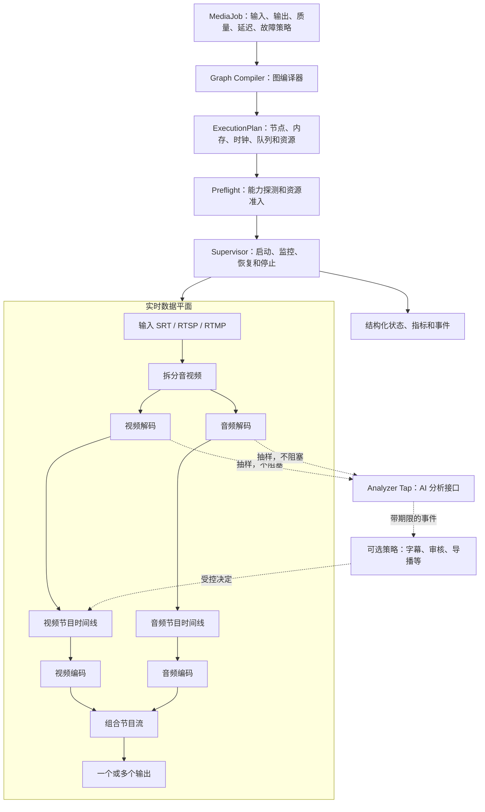

# 架构说明

`aimedia` 是意图驱动的实时媒体运行时。用户声明目标，系统先生成执行计划，再打开
网络、codec 和 GPU 资源。自动导播是可选策略，不是媒体主链的中心。

## 从目标到持续输出

## 图编译器

`aimedia-graph` 当前把 `aimedia/v1alpha2` `MediaJob` 归一化后编译成
`aimedia.plan/v1alpha1`。它不会打开 socket 或
GPU，而是提前回答以下问题：

- 需要哪些 transport、demux、decoder、timeline、encoder 和 output 节点；
- 数据位于普通内存还是 NVIDIA 显存；
- 数据仍使用输入时钟，还是已经映射到独立节目时钟；
- 每条队列容量是多少，队列满时采取什么策略；
- 需要多少个硬件解码和编码会话；
- 哪些节点已经实现，哪些只有 adapter，哪些仍然 pending。

`aimedia explain -f examples/single-srt.yaml --json` 输出的就是这份计划。CLI 不再手写
另一份可能与运行时漂移的拓扑。

## 五项一等契约

### 媒体格式

连接两端必须对 MPEG-TS、H.264 access unit、AAC ADTS、NV12 视频帧或 f32 PCM
达成一致。未来的格式协商在启动前完成，关键链路不依赖运行中猜测。

### 时间

输入 PTS 只用于映射。视频和音频进入 timeline 后使用独立、单调的节目时钟。输入
重启、时间戳回绕或漂移不能直接污染输出时间戳。

### 内存

每帧明确位于主机内存还是 GPU 显存。GPU surface 使用自动释放的 lease，节点不能
把裸指针或整数 handle 当成永久所有权。图编译器最终应能列出不可避免的内存复制。

### 容量和延迟

所有媒体边都使用有界队列。实时主链默认背压；抽样分析支路可以丢旧数据或只保留
最新样本，防止 AI 速度决定直播速度。

### 故障

关键节点失败会重连、重建或明确终止作业；非关键 AI 节点失败只产生事件。输出断线
期间不积累无限历史数据，恢复后重新建立节目边界。

## 当前代码与目标边界

当前已经具备 `MediaJob` 配置与显式旧配置转换、流式 MPEG-TS、SRT adapter、libxaac
adapter、有界 Sans-I/O RTMP 会话边界、节目时钟、有界单路调度、本机控制协议、首版
图编译器和 NVDEC/NVENC 帧级后端。RTSP 的压缩视频边界由 SDP 决定 H.264 或 HEVC，
两者进入同一个 8-bit NV12 GPU surface 契约；SRT/TS 和传统 RTMP 输入仍明确为 H.264。
两个视频 worker 共享
同一设备的 CUDA primary context，NVDEC 映射的 NV12 帧可在 GPU 内复制到持久注册的
NVENC surface。单路生产装配已经贯通，执行计划中的生产视频 codec 节点状态为
`adapterReady`；NVDEC 可同时租出的 surface 数由视频队列容量再加两个在途帧计算，
避免队列契约大于 GPU 资源池。

断流保活和输出恢复已经贯通真实 GPU 数据面。运行状态现在直接取自
`ExecutionPlan`、libsrt 和 NVDEC surface 租约：每条计划边都报告容量、满载策略、
当前水位和历史高水位，共享一个物理队列的边保持同一水位。v0.2 的互操作、网络损伤、
两小时稳定性和 Release 已完成；v0.3 按路线图依次推进 RTSP、
[RTMP/RTMPS 与 FLV](rfcs/0003-rtmp-flv.md)、
[受限 HEVC 输入桥接](rfcs/0004-hevc-bridge.md)和格式归一化，
多输出与通用 AI Tap 仍留在 v0.4。

## 扩展边界

- transport、codec 和 GPU 节点走本地稳定 ABI，避免热路径复制；
- AI analyzer 和策略通过有期限的事件交互，不直接持有节目时钟；
- 自动导播保留为可选策略和示例；
- WebAssembly 只考虑用于元数据和策略插件，不用于传递原始 GPU 视频帧。

完整决策见 [RFC 0001](rfcs/0001-intent-media-runtime.md)。
