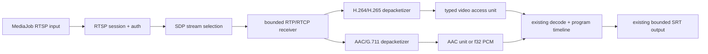

# RFC 0002：主流摄像机 RTSP/RTP 输入

- 状态：Accepted
- 日期：2026-08-06
- 影响版本：v0.3

## 用户闭环

中国大陆和海外的直播集成商都需要把网络摄像机接入同一套媒体作业。本阶段只解决
“拉流输入”，不实现 RTSP server、录像回放、ONVIF 设备管理、云台控制或观众播放：

```text
RTSP 摄像机 -> RTP 音视频 -> access unit / PCM -> 现有节目时间线
            -> NVDEC / audio decode -> NVENC + AAC -> SRT 节目输出
```

H.264 + AAC/G.711 会在 V3-02 形成真实单路闭环。H.265 在本阶段完成 SDP 识别、RTP
重组和类型化输出，但 NVDEC HEVC 到 NVENC H.264 的闭环属于 V3-04；在此之前必须报告
`videoBridgePending`，不能把“能收到 RTP 包”写成“支持 H.265 摄像机”。

## 为什么复用 retina

新增短目录 `crates/rtsp`，公开 Cargo 包名为 `aimedia-rtsp`。边界内部固定并审查 Rust
原生 `retina 0.4.19`，不把其类型暴露给 `core`、`graph` 或 `runtime`。

选择复用而不是独立重写 RTSP 的原因：

- RTSP 状态机本身不是 aimedia 的差异化价值，廉价摄像机的非标准行为和鉴权兼容才是
  主要成本；
- retina 已用于 ONVIF RTSP/1.0 摄像机场景，具备 Basic/Digest、TCP interleaved、
  UDP RTP、RTCP，以及 H.264、H.265、AAC 和 G.711 depacketizer；
- 其许可证为 MIT/Apache-2.0，V3-02B 已将 workspace MSRV 和 Docker builder
  统一为 Rust 1.88，不会隐式依赖更新编译器；运行时
  不引入 FFmpeg、GStreamer 或 `libav*`；
- 独立 adapter 可固定我们自己的事件、错误和重连契约，未来更换实现不改变 MediaJob。

代价是新增一组 Rust 依赖，并承担上游 API/行为变化。版本先精确锁定，依赖通过
`cargo deny`、源码许可证和最小 feature 审查；升级必须重新跑摄像机兼容矩阵。

参考规范与实现：

- [RTSP 1.0 / RFC 2326](https://www.rfc-editor.org/info/rfc2326/)
- [RTP / RFC 3550](https://www.rfc-editor.org/info/rfc3550/)
- [SDP / RFC 8866](https://www.rfc-editor.org/info/rfc8866/)
- [H.264 RTP / RFC 6184](https://www.rfc-editor.org/info/rfc6184/)
- [H.265 RTP / RFC 7798](https://www.rfc-editor.org/info/rfc7798/)
- [AAC RTP / RFC 3640](https://www.rfc-editor.org/info/rfc3640/)
- [G.711 RTP profile / RFC 3551](https://www.rfc-editor.org/info/rfc3551/)
- [HTTP Digest / RFC 7616](https://www.rfc-editor.org/info/rfc7616/)
- [ONVIF Profile T](https://www.onvif.org/profiles/profile-t/)
- [retina 0.4.19](https://docs.rs/retina/0.4.19/retina/)

## 固定支持范围

### RTSP 会话

- 只做 RTSP client，支持 `OPTIONS`、`DESCRIBE`、每个媒体流的 `SETUP`、聚合 `PLAY`、
  keepalive 和尽力 `TEARDOWN`。
- 只接受 `rtsp://`。RTSP over TLS、HTTP tunnel、multicast、RTSP 2.0 和 SRTP 暂不支持。
- Basic 与 Digest 鉴权；用户名可写配置，密码只能使用环境变量或挂载文件引用。
- 默认 RTP over RTSP/TCP interleaved；UDP unicast 在真实摄像机和网络损伤测试完成前为
  `experimental`。
- 每个端点只选择一个视频流和最多一个音频流；多 profile/多码流选择在 SDP 阶段按
  MediaJob 约束完成，不在运行中猜测。

### SDP 与媒体

- H.264：`packetization-mode=0/1`，single NAL、STAP-A、FU-A，输出 Annex-B access unit；
  模式 2、STAP-B、MTAP 和 FU-B 明确拒绝。
- H.265：single NAL、AP、FU，输出 Annex-B access unit；真正转 H.264 留给 V3-04。
- AAC：只接受 `MPEG4-GENERIC`、AAC-LC、44.1/48kHz、单/双声道；根据 SDP
  `AudioSpecificConfig` 和 AU header 恢复 AAC 单元，进入统一音频解码/重采样阶段。
- G.711：静态或显式 `PCMA`/`PCMU`，8kHz 单声道，直接解码为交错 `f32 PCM`。
- 摄像机元数据、JPEG、G.726、MP2、AMR、LATM、B 帧重排和厂商私有 payload 不在本阶段。

### 时间和有界性

- RTP sequence 使用固定重排窗口；超窗、重复或永久缺包只丢弃受影响 access unit。
- 32-bit RTP timestamp 按流回绕展开，RTCP Sender Report 只用于源时间映射；输出仍由
  aimedia 独立节目时钟生成。
- 每个流的 RTP 重排、access unit 重组和 adapter 输出队列都有硬上限；NAL/AU 超过
  上限时丢弃当前单元并等待下一个恢复边界。
- H.264/H.265 在重新连接、SSRC 改变、sequence 跳变或参数集变化后等待下一张可独立
  解码的画面；绝不把新旧会话字节拼成一个 access unit。

## MediaJob 契约

RTSP 输入沿用 `inputs[].uri`，新增协议专属配置：

```yaml
inputs:
  - name: camera
    uri: rtsp://192.0.2.10/Streaming/Channels/101
    rtsp:
      transport: tcp
      username: admin
      passwordRef:
        env: AIMEDIA_CAMERA_PASSWORD
      connectTimeoutMs: 3000
      readTimeoutMs: 5000
      keepaliveMs: 15000
      reconnect:
        enabled: true
        initialBackoffMs: 250
        maxBackoffMs: 5000
```

URI 中的 userinfo、`password`、`token` 和厂商密钥 query 一律拒绝并从日志隐藏。SRT 与
RTSP 配置不能同时生效；scheme 与协议专属字段冲突时在打开网络之前失败。

## 数据流与故障边界



DNS、TCP connect、401/403、DESCRIBE/SDP、SETUP transport、PLAY、RTP timeout、codec 和
payload 损坏必须使用稳定阶段码。可恢复的网络/会话错误只重建该输入；格式不支持在启动
前终止；队列满按契约丢旧数据或背压，禁止无界缓存。

## 验收门槛

- CPU：RTSP message/SDP fixture、RTP 回绕/乱序/重复/缺包、H.264/H.265 分片、AAC AU、
  G.711 解码、大小上限和错误码。
- 互操作：FFmpeg 测试 server、MediaMTX，以及至少两台不同厂商或两个 ONVIF 合规设备；
  每项记录型号/固件/transport/codec，模拟器不能替代真实设备证据。
- 网络：TCP 与 UDP、1% 丢包、20ms 抖动、40ms RTT、会话超时、401 重试、输入重连。
- GPU 闭环：H.264 + AAC/G.711 输入，1080p30 输出 SRT，PTS/DTS/PCR 单调；H.265 只验
  depacketizer，直到 V3-04 才升级完整支持。
- 稳定性：两小时运行中所有队列和重组缓存有水位，RSS/GPU 内存不持续增长；凭证不在
  日志、状态、错误或崩溃上下文出现。

## PR 切片

1. 契约、依赖审查、MediaJob schema 和 fixture 语料。
2. `crates/rtsp` adapter：会话、鉴权、SDP 与类型化媒体事件。
3. TCP interleaved H.264/AAC/G.711 单路运行时闭环。
4. UDP RTP/RTCP、重排和超时恢复。
5. H.265 depacketizer 边界与 V3-04 handoff。
6. 外部设备、网络损伤、两小时 soak 和支持矩阵升级。
