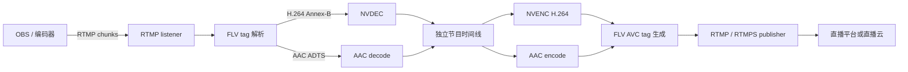

# RFC 0003：RTMP/RTMPS 与 FLV 边界

- 状态：Accepted for staged implementation
- 日期：2026-08-06
- 路线图：V3-03

## 为什么现在做

SRT 适合远程贡献，RTSP 适合摄像机接入，但国内外大多数直播平台仍把 RTMP 或
RTMPS 作为共同发布入口。V3-03 的目标不是建设 RTMP 媒体服务器，而是补上两个真实
工作流：

1. OBS、硬件编码器或上游服务向 aimedia 的单连接 RTMP listener 发布 H.264/AAC。
2. aimedia 把处理后的 H.264/AAC 通过 RTMP 或 RTMPS 推送到直播云和创作者平台。

RTMP pull、观众播放、GOP cache、边缘分发、HTTP-FLV、Enhanced RTMP、HEVC 和 AV1
不进入本阶段。

## 协议在流水线里的位置



RTMP 是连接、握手、命令和分块传输协议；FLV tag 是这条连接中承载音视频的媒体格式。
两者必须分层，不能把网络重连逻辑混进 H.264/AAC 转换。

## P0 媒体约束

- 输入：RTMP listener，单端点同时只接受一个 publisher。
- 输出：RTMP 或 RTMPS publisher；RTMPS 使用 rustls 和公开 WebPKI 信任根，禁止关闭证书校验。
- 视频：传统 FLV AVC tag 中的 H.264 8-bit 4:2:0；不接受 Enhanced RTMP codec。
- 音频：AAC-LC；不接受 MP3、Opus 或厂商私有音频 tag。
- 分辨率、帧率和采样率仍受当前 MediaJob profile 限制。
- 每条连接的单个 RTMP message 默认最多 8 MiB，配置硬上限为 16 MiB。

### H.264 转换

RTMP/FLV 使用 `AVCDecoderConfigurationRecord` 保存 SPS/PPS，并用长度前缀保存 NAL unit；
当前 NVDEC/NVENC 边界使用 Annex-B start code。输入端必须先收到 AVC sequence header，
把长度前缀 NAL 转为 Annex-B，并等到 IDR 后才开放解码。输出端从 NVENC 的 SPS/PPS
构建 sequence header，把 access unit 转为长度前缀形式。

重连后不得续用旧连接的配置状态。输出必须重新发送 metadata、AVC sequence header、
AAC sequence header，并请求新的 IDR。

V3-03C 已在 `crates/rtmp/src/avc.rs` 实现双向转换：输入只在合法 sequence header 后
接收 AVCC NAL，配置变化或 end-of-sequence 后重新等待 IDR，并在首个 IDR 前附加
Annex-B SPS/PPS；输出从 Annex-B 提取 SPS/PPS、生成四字节长度前缀 AVCC，并保证新的
sequence header 先于对应媒体。composition-time offset 在输出前校验为 signed 24-bit。

### AAC 转换

FLV 的 AAC sequence header 保存 `AudioSpecificConfig`，普通音频 tag 只保存 AAC raw
payload；当前 AAC decoder 接收 ADTS。输入端据此为 raw payload 重建 ADTS，输出端从
ADTS 提取配置和 raw payload。没有合法 sequence header 时不把音频送入 decoder。

V3-03C 的 `crates/rtmp/src/aac.rs` 固定接受 AAC-LC、48 kHz、双声道；每个 raw tag
重建为一个 7 字节无 CRC ADTS header，每个输出 ADTS packet 也必须恰好包含一帧。首次
输出或连接重建后先发送 `AudioSpecificConfig`，不在这一层做重采样或声道转换。

## 时钟和重连

- RTMP timestamp 是每连接 32-bit 毫秒值；输入适配器负责回绕展开，只用于映射。
- 输出 timestamp 来自 aimedia 独立节目时钟，不能直接延续输入 RTMP timestamp。
- 输入 publisher 断开后清空握手、FLV 配置和时间映射；新 publisher 从 sequence header
  与 IDR 重新开始。
- 输出断开时丢弃历史编码包，不在内存中等待平台恢复；指数退避重连后重新发配置和 IDR。
- 网络读写、decoded event、codec 和发送队列都有硬上限；没有“临时”无界队列。

## 配置契约

URI 只保存主机和 application path，stream name 单独配置。这样错误和日志可以显示
endpoint 阶段而不泄露平台 stream key。

```yaml
inputs:
  - name: encoder
    uri: rtmp://0.0.0.0:1935/live
    rtmp:
      mode: listen
      streamName: camera

outputs:
  - name: program
    uri: rtmps://publish.example.test/live
    rtmp:
      mode: publish
      streamNameRef:
        env: AIMEDIA_RTMP_STREAM_NAME
```

规则：

- 输入只接受 `rtmp://` + `mode: listen`；Alpha 不提供 RTMPS listener。
- 输出接受 `rtmp://` 或 `rtmps://` + `mode: publish`。
- `streamName` 与 `streamNameRef` 必须二选一；任何凭证都必须使用引用。
- URI userinfo、query、fragment 和尾随 `/` 被拒绝，避免 stream key 混入错误或日志。
- `connectTimeoutMs` 管 TCP，`handshakeTimeoutMs` 管 TLS/RTMP 建连，`readTimeoutMs`
  管建连后的对端失活。
- `maxMessageBytes` 默认 8 MiB，可配置范围 64 KiB—16 MiB。

当前 `aimedia explain` 和 `aimedia run --dry-run` 会展示完整 pending 图；真实运行会在
打开网络、codec 或 GPU 前返回 `rtmpDataPlanePending`。

## Rust 依赖决定

协议核心以 `2026.1.0-canary.6` 为基线，并精确固定到
[`anvsk/rtmp-rs@00e97a6`](https://github.com/anvsk/rtmp-rs/commit/00e97a651d0a08a5b7e4837cc2ad8b4701bc2e9a)：

- Apache-2.0、Rust 1.88、零第三方依赖、`no_std`、Sans-I/O。
- 同时提供 publish client、play client 和 server connection 状态机。
- socket、超时、rustls、任务和背压由 aimedia 持有，不把 Tokio runtime 藏进协议库。
- 在 aimedia 的 Rust 1.88 工具链上，上游 89 项 library tests 全部通过。

V3-03F4 长稳预检发现原版在收到与本地默认值不同的 `SetPeerBandwidth` 后，回复窗口与
内部 ACK 等待窗口不一致；即使对齐数值，发送侧仍可能在 ACK 完成网络往返前先进入
`Disconnecting`。实际 pcap 证明 MediaMTX 已在 `2,500,256` 字节返回 ACK，但原版在同一
边界先判定超时，表现为正常 TCP 连接每两分钟左右被主动重建。

固定 fork 做了两项最小修复：回复与对端请求使用相同窗口；增加默认保持原行为的
`disconnect_on_missing_ack` 选项。aimedia publisher 显式关闭 ACK 强制断线，但仍正常
收发 ACK；故障和背压由 aimedia 已有的有界发送缓冲、TCP 写超时和重连状态机判定。
补丁保留完整提交、问题记录和 Apache-2.0 来源；后续优先推动上游合并，再回到官方版本。

它仍是 canary，不能直接泄漏到公共 API。V3-03B 已在短目录 `crates/rtmp` 中完成明文
发布回环、最大 message、恶意 chunk stream、控制发送缓冲、断线隔离和流名脱敏门禁，
上游类型全部留在 crate 内部。入口保险丝先解析 RTMP chunk header，再把合格字节交给
协议状态机，避免仅依赖上游内部缓冲策略。若后续互操作发现协议缺口，可在不改变 runtime
公共接口的前提下替换为自有小型状态机或重新评估
[`rtmp-rs`](https://github.com/torresjeff/rtmp-rs)。

V3-03D 在同一短目录新增 `source.rs`，由 aimedia 自己持有 `TcpListener`、超时和单连接
生命周期。listener 产生的 FLV 音视频 tag 先被转换为公共 `MediaPacket`，再直接进入
H.264/AAC codec 队列，因此不会为了 RTMP 复制一套运行时，也不会错误经过 MPEG-TS
demux。替换 publisher 时重建协议与 AVC/AAC 转换状态，并给两条媒体流各标记一次
discontinuity；旧连接的待处理媒体不会跨会话保留。

V3-03E 新增同级短文件 `sink.rs`。运行时的 packet sink 直接接收编码后的 H.264 Annex-B
与 AAC ADTS，不先封装成临时 MPEG-TS。明文 RTMP 使用 TCP；RTMPS 使用 rustls 和公开
WebPKI 信任根，校验证书与主机名且没有“不安全跳过”开关。网络写失败后当前 access unit
立即丢弃，连接在独立有界任务中指数退避；恢复后 AVC/AAC 转换器清空，音频和非 IDR
视频继续丢弃，直到新的 SPS/PPS + IDR 到达。这样平台不会看到跨连接拼接的 GOP，媒体
主链也不会被数秒连接超时或无限历史队列拖住。

未选择的主要候选：

| 候选 | 结果 | 原因 |
|---|---|---|
| `rtmp-rs 0.5.0` | fallback | client/server 与 rustls 齐全，但高层 Tokio server/registry 较重，边界和队列不完全由 aimedia 控制 |
| `oxideav-rtmp 0.0.6` | 暂不选 | ingest/push 功能多，但采用阻塞式连接模型，RTMPS 尚不是一等能力 |
| `scuffle-rtmp 0.2.3` | 不选 | 适合 server ingest，但没有 P0 所需的 publisher client |
| `librtmp2 0.5.0` | 不选 | Rust 1.93 高于项目 MSRV，默认 TLS 依赖 OpenSSL |

依赖选择依据是边界和可控性，不是功能数量或 GitHub star。

## 交付拆分

- V3-03A：本 RFC、配置 schema、pending 执行图、稳定错误码和示例。
- V3-03B：`crates/rtmp` Sans-I/O 会话适配器、上限保护、RTMP 明文回环。
- V3-03C：AVC/AAC sequence header、Annex-B/AVCC、ADTS/raw 双向转换。
- V3-03D：RTMP listener 输入接入单路原生运行时及重发布恢复。
- V3-03E：RTMP/RTMPS publisher、rustls、重连、配置重发和 IDR 闸门。
- V3-03F：OBS/FFmpeg/MediaMTX 互操作、网络故障、平台前置 smoke 和两小时 soak。

只有 V3-03F 通过后，支持矩阵才把 RTMP/RTMPS + FLV 升级为 `supported`。
