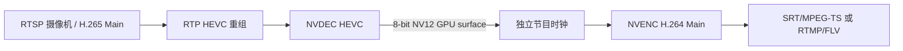

# RFC 0004：RTSP HEVC 输入到 H.264 输出桥接

- 状态：Accepted；V3-04A/B/D implemented，V3-04C pending
- 日期：2026-08-10
- 路线图：V3-04

## 用户问题

中国大陆的摄像机和 NVR 经常提供 RTSP H.265/HEVC，但直播云和海外创作者平台的共同
发布基线仍是 H.264/AAC。用户需要的是“摄像机能接入并发布”，不是把 HEVC 原样塞进
传统 RTMP/FLV。

V3-02 已把 H.265 RTP single NAL、AP 和 FU 重组为带 `CodecId::H265` 的 Annex-B access
unit。V3-04 只补齐后半段：NVDEC 解码为 GPU NV12 surface，再复用现有 NVENC H.264、
独立节目时钟和 SRT/RTMP publisher。

## 固定支持边界

- 输入 transport：V3-04 只扩展 RTSP interleaved TCP；SRT/MPEG-TS H.265 留到有真实需求
  后评估。
- 输入视频：HEVC Main、8-bit、4:2:0、progressive、最高 1920x1080 和 30fps。
- 输出视频：继续使用现有 H.264 Main、8-bit 4:2:0、无 B 帧的 NVENC 路径。
- 音频：沿用 RTSP AAC-LC 或 G.711 到 AAC-LC 的现有路径。
- 不做 HEVC Main10、HDR 元数据、色调映射、H.265 输出、Enhanced RTMP、缩放或变帧率。

输入规格与配置声明的宽高、帧率不一致时明确失败，不隐式缩放或降帧。GPU 不支持该
HEVC profile/level/尺寸时在创建 decoder 时返回 `Unsupported`，不静默回退 CPU。

## 后端设计

`NvdecConfig` 增加类型化 `NvdecCodec::{H264, Hevc}`。同一值必须同时用于：

1. `CUVIDPARSERPARAMS.CodecType`；
2. sequence callback 的 `CUVIDDECODECAPS.eCodecType`；
3. `CUVIDDECODECREATEINFO.CodecType`；
4. 公共 `MediaPacket.codec` 的入口校验。

这样不能出现“HEVC parser 配 H.264 capability”一类半切换状态。两种 codec 都只开放
NV12 输出，继续使用同一个代际 surface lease、CUDA primary context 和 GPU 内
NVDEC-to-NVENC copy，不新增 CPU 像素缓冲。

RTSP SDP 在连接后才确定 codec，因此 CLI 先建立 DESCRIBE/SETUP/PLAY，再用 profile
选择 decoder。类型化执行图不能提前谎称 RTSP 一定是 H.264；RTSP 到 decoder 的边改为
`compressedVideo`，节点说明限定为 H.264/HEVC。SRT/TS 和传统 RTMP 输入仍保持
`h264AccessUnit`。

## 恢复语义

- H.265 IRAP 通过公共 `MediaPacket.keyframe` 表达；除依赖库的 random-access 标记外，
  adapter 会从 Annex-B NAL type 16—23 兜底识别，避免 RTP relay 丢失标记后永久等待。
  VPS/SPS/PPS 由 RTSP depacketizer 以 Annex-B 形式提供给 NVDEC parser。
- 连接重建、RTP 丢包或参数集变化产生 discontinuity；decoder 退休当前 generation，
  丢弃非 IRAP access unit，直到新的独立画面再创建输出。
- 已租出的旧 generation surface 仍由 RAII 释放，不能为了重建 decoder 强制回收。
- NVENC 与输出端只看到 NV12 frame，不需要知道输入原来是 H.264 还是 HEVC。

## 交付和证据

- V3-04A：codec 可配置的 NVDEC 后端与 HEVC 单帧 GPU decode 证据。
- V3-04B：RTSP profile 选择、类型化执行图和稳定错误。
- V3-04C：软件 RTSP/HEVC 发送端经过真实 GPU 转成 H.264，并由外部接收端验证。
- V3-04D：文档与支持矩阵校准；物理摄像机仍由 V3-02F2 单独认证。

V3-04C 已用 90 秒软件 RTSP/HEVC 源证明 TS/SRT 输出为 H.264/AAC、首视频包为
keyframe、PTS/DTS/PCR 单调、无 CPU 像素回退且 surface 水位不越界；门禁还覆盖发布源
断开恢复和 40ms RTT、20ms 抖动、1% 丢包。该短证据不能写成两小时或生产稳定性证据，
物理摄像机和长稳仍归 V3-02F。实现、修复根因和结构化指标见
[HEVC 输入桥接验证记录](../reports/hevc.md)。
